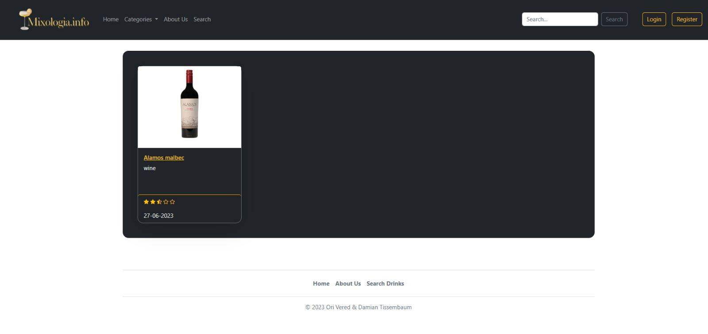
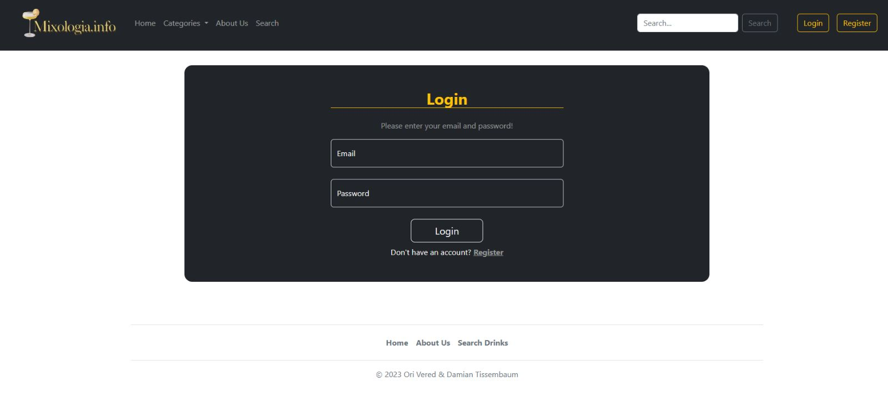
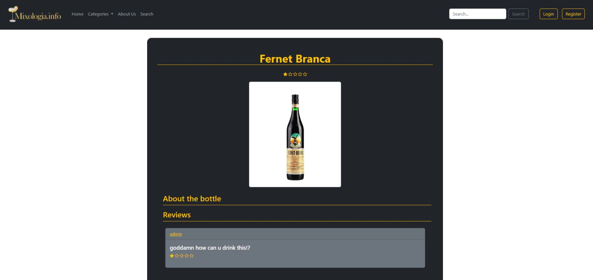
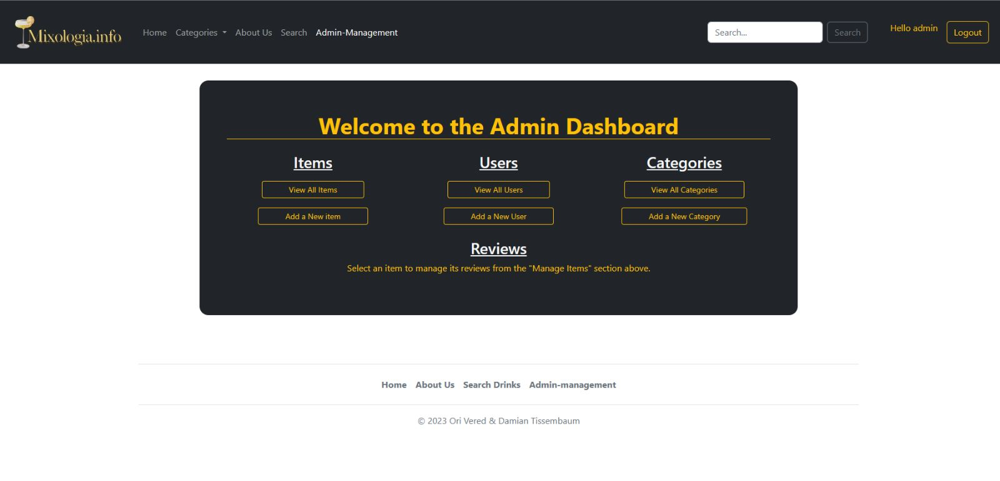
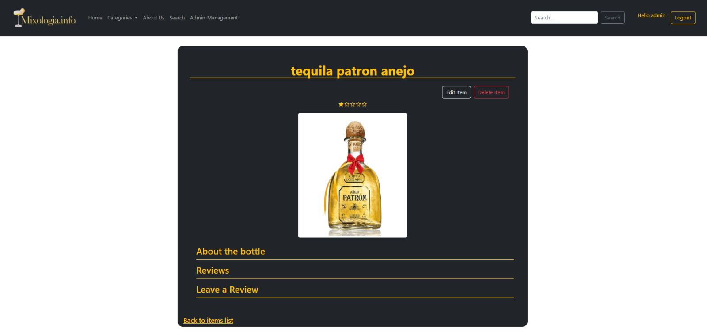

# Alcoholic Drinks Website

This project is a comprehensive online platform for reviewing and discussing a wide variety of alcoholic beverages.

## Important Information for Grader

Please use the following credentials to explore different user capabilities in the system:

### Admin Access:

- **Email**: admin@gmail.com
- **Password**: password

As an admin, you will have access to the admin panel where you can manage items, categories, and users.

### User Access:

- **Email**: john@gmail.com
- **Password**: password

As a user, you can post reviews, view items.

## Table of Contents

- [Overview](#overview)
- [Authors](#authors)
- [Features](#features)
- [Getting Started](#getting-started)
   - [Prerequisites](#prerequisites)
   - [Installation](#installation)
- [Usage](#usage)
- [Different pages](#different-pages)
- [Admin-management](#admin-management)

---------------------
## Overview
It provides a unique space for users to share their thoughts, experiences, and recommendations regarding different drinks, while also giving them the ability to categorize and organize the beverage offerings to enhance the overall user experience.
The heart of this platform lies in its user-generated content, featuring an extensive collection of reviews which are freely contributed by the site's community members. Furthermore, our platform offers an added layer of functionality through its ability to manage different categories of beverages, allowing users to easily navigate and explore the diverse world of alcoholic drinks based on their personal preferences.
Notably, admins can not only add and review items, but also modify existing ones, ensuring that the platform's content remains up-to-date and reflective of the latest trends and discoveries in the beverage industry.

With a user-friendly interface and a strong focus on community engagement, our platform aims to serve as a definitive destination for enthusiasts and connoisseurs of alcoholic beverages alike. Whether you're on the lookout for a fine wine to pair with your dinner, or simply exploring the world of craft beers, our platform offers a treasure trove of insights to guide your journey.

---------------------

## Authors
* Name: Ori Vered Email:orive@edu.hac.ac.il / ori.vered@gmail.com
* Name:  Email: damianti@edu.hac.ac.il / damian.tissembaum@gmail.com

---------------------
## Features

- User Registration & Management: Users can easily register and manage their profiles. A new user can register himself, and login where an admin can add and delete admins and users 
- Category Management: admins can create and manage categories, providing a structured and organized way to navigate the wide array of beverages.
- Item management: admins can add, edit and erase items. Users dont have any impact on the management of items. 
- Reviews management: Users can add new reviews, sharing their personal experiences and ratings.They can also delete their own reviews. Admins can add and delete reviews of themselves and other users and admins
- Admin Panel: An exclusive admin panel is available for superior control and management, providing capabilities for user management and review oversight.
- Search for drinks: use the search place to search for drinks with the name you write  
---------------------
## Getting Started

### Prerequisites

Before getting started, make sure you have the following:

- SQL Server: Set up a SQL Server and create a database named "ex5" for storing users, items, categories and reviews.
---------------------
### Installation

1. Clone the repository:

   ```shell
   git clone https://github.com/Solange-s-Courses/ex5-spring-ex5_ori_vered_damian_tissembaum
    
   ```
   configure the maven.    

2. Set up the back-end:
   Start Xampp apache server
   Start Xampp MySQL server
   Start IntelliJ server

---------------------
## Usage

1. Set up the back-end:
    - Start Xampp apache server
    - Start Xampp MySQL server
    - Start Spring server on IntelliJ

2. Access the website at http://localhost:8080.

---------------------
## Different-pages

- *Home*: Click on Home (in navbar). You will see the drinks that our page have in storage to comment!
- *Categories*: Click on Categories (in navbar) > and then select the category you want to explore to look for drinks there 
- *About us*: Click on About us (in navbar) > you will see our motivation and history
- *Search*: Click on Search (in navbar) > search for drinks that contain the name you write


---------------------
## Admin-management

This page is only for admins. Here you can choose between these options:

- View all items stored
- Add a new item to the storage.
- View all users stored
- Add a new user to the storage.
- View all categories stored
- Add a new category to the storage.

## Screen Previews

### Search Page
The Search Page allows you to look up drinks by name:



### Login Page
Here is a preview of the Login Page where users and admins can sign into their accounts:



### User Item Page
This is the User Item Page where users can view the details of a specific drink:



### Admin Management Page
The Admin Management Page provides admins with several management options:



### Admin Item Management Page
Finally, this is the Admin Item Management Page, where admins can manage the drink entries:



